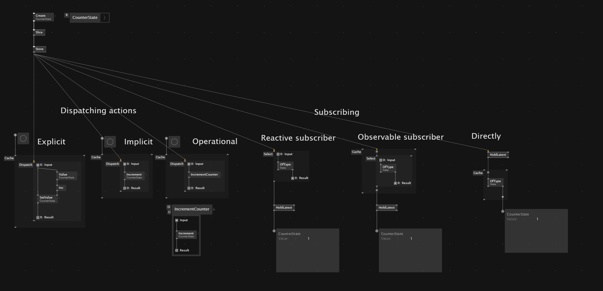
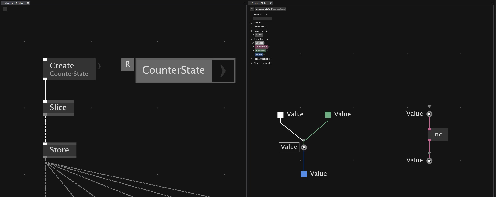
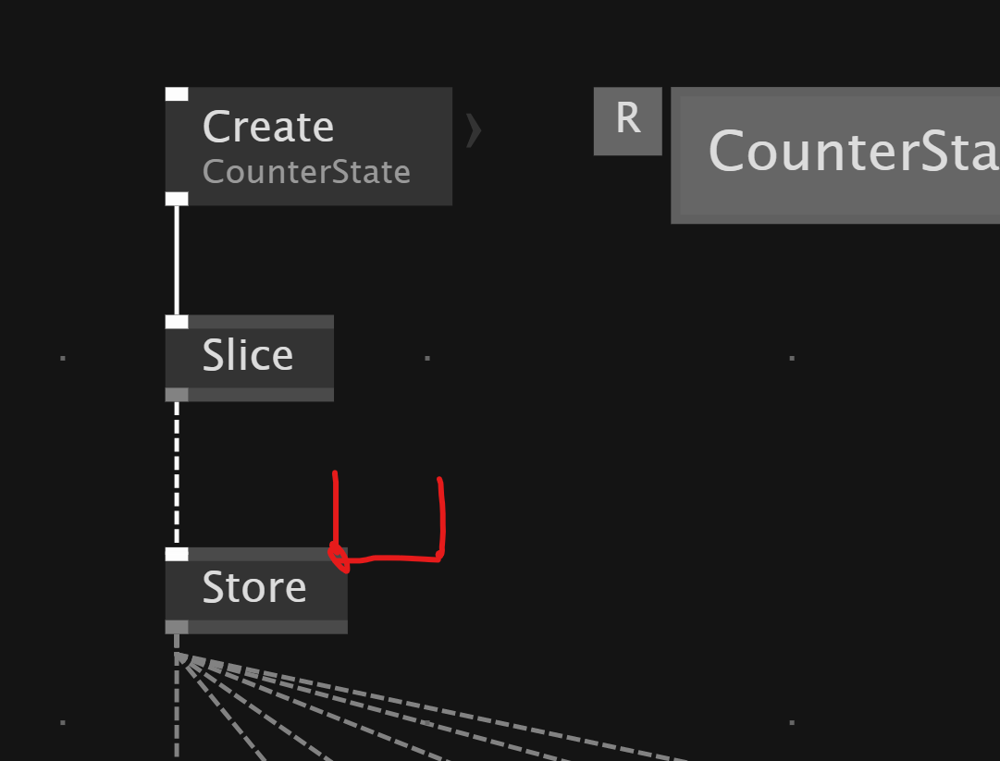
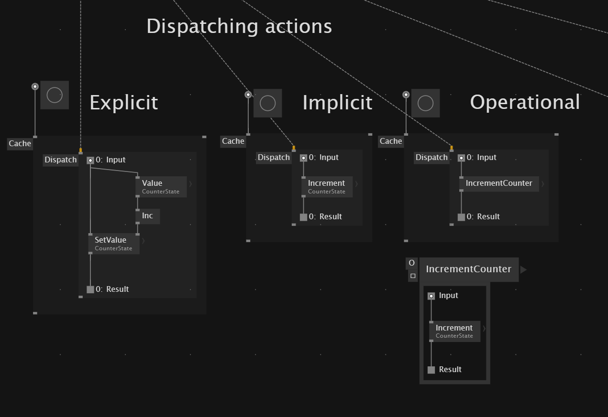
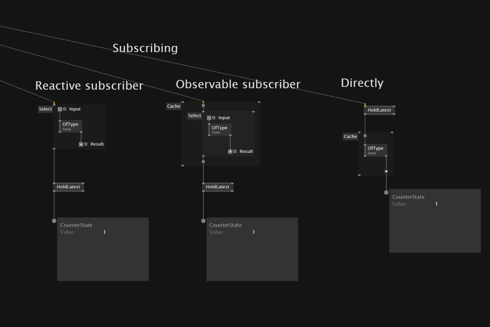

# VL.Redux (WIP)

An experiment with an MVU approach for vvvv.

The idea is to define state as slice records:

Slices can define reusable state mutations or mutations directly in place.
The store combines multiple slices:

All slices must be known when the store is created.
Actions can then be dispatched by state type:

Subscribe to receive state updates:

The model holds the state, while the view creates channels and dispatches actions. Each action passes through the MVU pipeline and produces an updated state.

This is still experimental, but it works well in the vvvv context.

Current limitations:

- Each slice must use a unique type.
- All slices must be known at application startup.
- This is a minimal proof of concept without middleware, logging, or development tools.
- State is not serializable by default.

Notice: 

This is not an `agnostic` redux implementation, but more of `Reactive` state management tool.